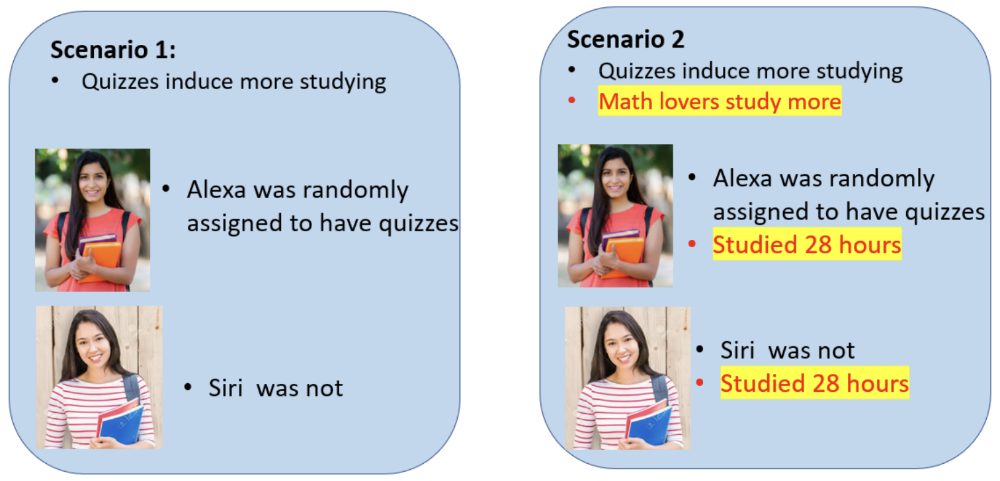

```{r}
#| label: setup

library(tidyverse)
library(gt)
library(kableExtra)
library(readxl)
library(wesanderson) # colours
library(gghalves)
library(broom)
library(broom.mixed)
library(ggpubr)
```

# Why mediation analysis might often be a bad idea {style="text-align: center;"}

<br>

::: {.fragment}
... or is at least a lot harder than we might like to think
:::

--- 

## {background-image="images/adam_eve.jpg" background-size="100" background-position="center 50%"}


::: {.absolute left="0%" top="50%" style="font-size:1.5em; padding: 0.5em 1em; background-color: rgba(40, 40, 40, .5); backdrop-filter: blur(5px); box-shadow: 0 0 1rem 0 rgba(0, 0, 0, .5); border-radius: 5px;"}
what mediation analysis looks like to researchers
:::

---

## {background-image="images/adam_eve.jpg" background-size="100%" background-position="center 20%"}

::: {.absolute left="0%" top="50%" style="font-size:1.5em; padding: 0.5em 1em; background-color: rgba(40, 40, 40, .5); backdrop-filter: blur(5px); box-shadow: 0 0 1rem 0 rgba(0, 0, 0, .5); border-radius: 5px;"}
... what it often turns out to be
:::

---

### *Disclaimer*

This talk is: 

- focusing on problems
- light on solutions
- given by **me**, i.e. someone without specific expertise in causal inference and statistics

<br>

Check out the [reading list](#reading-list) to learn from actual experts.

<br>

This talk is mostly based on [Data Colada post 103](http://datacolada.org/103)

---

## Overview

::: {.fragment fragment-index=1}
::: {.fragment .highlight-blue fragment-index=6}
1. Mediation is tempting
:::
:::

::: {.fragment fragment-index=2}
2. What does a (typical) mediation analysis look like?
:::

::: {.fragment fragment-index=3}
3. The model is probably wrong

    - intuitive issues
    - less intuitive issues
:::

::: {.fragment fragment-index=4}
4. How **not** to defend your mediation model
:::

::: {.fragment fragment-index=5}
5. What now? 
:::

---

::: {.big-center}
As researchers, we want to understand mechanisms. 
:::

---

## {background-image="images/scurvy.jpg" background-size="100%" background-position="center 50%"}

::: {.absolute right="-15%" bottom="0%" style="font-size:0.5em; padding: 0.3em 0.8em; background-color: rgba(40, 40, 40, .5); backdrop-filter: blur(5px); box-shadow: 0 0 1rem 0 rgba(0, 0, 0, .5); border-radius: 5px; text-align: right;"}
James Lind's treating scurvy with citrus fruit. 

*Source: https://www.bbc.com/news/uk-england-37320399 *
:::

. . .

::: {style="position: absolute; top: 50%; left: 0; right: 0; margin: auto; width: fit-content; font-size:1.5em; padding: 0.5em 1em; background-color: rgba(40, 40, 40, .5); backdrop-filter: blur(5px); box-shadow: 0 0 1rem 0 rgba(0, 0, 0, .5); border-radius: 5px;"}
eating lemons → cure scurvy
:::
---

## {background-image="images/scurvy.jpg" background-size="100%" background-position="center 50%"}

::: {.absolute right="-15%" bottom="0%" style="font-size:0.5em; padding: 0.3em 0.8em; background-color: rgba(40, 40, 40, .5); backdrop-filter: blur(5px); box-shadow: 0 0 1rem 0 rgba(0, 0, 0, .5); border-radius: 5px; text-align: right;"}
James Lind's treating scurvy with citrus fruit. 

*Source: https://www.bbc.com/news/uk-england-37320399 *
:::

::: {style="position: absolute; top: 50%; left: 0; right: 0; margin: auto; width: fit-content; font-size:1.5em; padding: 0.5em 1em; background-color: rgba(40, 40, 40, .5); backdrop-filter: blur(5px); box-shadow: 0 0 1rem 0 rgba(0, 0, 0, .5); border-radius: 5px;"}
But how?
:::

::: {.notes}
When Lind conducted his famous trial in 1747, the concept of vitamins didn't exist at all — that wouldn't come until the early 20th century. He just observed empirically that citrus fruits cured scurvy, but had no mechanistic explanation for why.

Vitamin C (ascorbic acid) was only isolated and identified in 1932 by Albert Szent-Györgyi, nearly 200 years after Lind's trial.
:::

---

## {background-image="images/scurvy.jpg" background-size="100%" background-position="center 50%"}

::: {.absolute right="-15%" bottom="0%" style="font-size:0.5em; padding: 0.3em 0.8em; background-color: rgba(40, 40, 40, .5); backdrop-filter: blur(5px); box-shadow: 0 0 1rem 0 rgba(0, 0, 0, .5); border-radius: 5px; text-align: right;"}
James Lind's treating scurvy with citrus fruit. 

*Source: https://www.bbc.com/news/uk-england-37320399 *
:::

::: {style="position: absolute; top: 50%; left: 0; right: 0; margin: auto; width: fit-content; font-size:1.5em; padding: 0.5em 1em; background-color: rgba(40, 40, 40, .5); backdrop-filter: blur(5px); box-shadow: 0 0 1rem 0 rgba(0, 0, 0, .5); border-radius: 5px;"}
eating lemons → absorb vitamine c → cure scurvy
:::

---

::: {.big-center}
As a researchers, we constantly think about mediation.


::: {.fragment}
"How does X affect Y?" and "Why does X affect Y?" are questions about mediation. 
:::

:::

---

## Overview

1. Mediation is tempting

::: {.fragment .highlight-blue fragment-index=1}
2. What does a (typical) mediation analysis look like?
:::

3. The model is probably wrong

    - intuitive issues
    - less intuitive issues

4. How **not** to defend your mediation model

5. What now? 

---

::: {.big-center}
"Do regular tests improve math grades for students?"


::: {.fragment}
We can run an RCT and get the causal effect
:::

::: {.fragment}
Suppose it works
:::

:::

--- 

::: {.big-center}
Next, we might want to ask: "Why?"/"How?"


::: {.fragment}
Suppose we have an idea: 

"It might be because regular tests make students study more"
:::

::: {.fragment}
That's a mediation question
:::

:::

---

## The 3 steps of mediation

:::: {.columns}

::: {.column width="50%"}

**Step 1** — Total effect of X on Y

$$Y = \alpha + cX$$

<br>

**Step 2** — Effect of X on mediator M

$$M = \alpha + aX$$

<br>

**Step 3** — Effect of X on Y, controlling for M

$$Y = \alpha + c'X + bM$$

<br>

Mediation = $c - c'$

:::

::: {.column width="50%"}

```{=html}
<svg viewBox="0 0 400 160" xmlns="http://www.w3.org/2000/svg" style="width:100%; height:auto; margin-top: -20px;">

  <rect x="10" y="45" width="120" height="60" rx="6" fill="#1E293B" stroke="#14B8A6" stroke-width="2"/>
  <text x="70" y="68" text-anchor="middle" fill="#14B8A6" font-size="13" font-family="Calibri">X</text>
  <text x="70" y="86" text-anchor="middle" fill="white" font-size="12" font-family="Calibri">Quizzes</text>

  <rect x="270" y="45" width="120" height="60" rx="6" fill="#1E293B" stroke="#14B8A6" stroke-width="2"/>
  <text x="330" y="68" text-anchor="middle" fill="#14B8A6" font-size="13" font-family="Calibri">Y</text>
  <text x="330" y="86" text-anchor="middle" fill="white" font-size="12" font-family="Calibri">Exam grade</text>

  <line x1="130" y1="75" x2="270" y2="75" stroke="#14B8A6" stroke-width="2" marker-end="url(#arrow-teal-p1)"/>
  <text x="200" y="67" text-anchor="middle" fill="#14B8A6" font-size="14" font-family="Calibri">c</text>

  <defs>
    <marker id="arrow-teal-p1" markerWidth="8" markerHeight="8" refX="6" refY="3" orient="auto">
      <path d="M0,0 L0,6 L8,3 z" fill="#14B8A6"/>
    </marker>
  </defs>

</svg>
```

```{=html}
<svg viewBox="0 0 400 160" xmlns="http://www.w3.org/2000/svg" style="width:100%; height:auto; margin-top: -20px;">

  <rect x="10" y="45" width="120" height="60" rx="6" fill="#1E293B" stroke="#14B8A6" stroke-width="2"/>
  <text x="70" y="68" text-anchor="middle" fill="#14B8A6" font-size="13" font-family="Calibri">X</text>
  <text x="70" y="86" text-anchor="middle" fill="white" font-size="12" font-family="Calibri">Quizzes</text>

  <rect x="150" y="45" width="120" height="60" rx="6" fill="#1E293B" stroke="#14B8A6" stroke-width="2"/>
  <text x="210" y="68" text-anchor="middle" fill="#14B8A6" font-size="13" font-family="Calibri">M</text>
  <text x="210" y="86" text-anchor="middle" fill="white" font-size="12" font-family="Calibri">Study hours</text>

  <line x1="130" y1="75" x2="150" y2="75" stroke="#14B8A6" stroke-width="2" marker-end="url(#arrow-teal-p2)"/>
  <text x="140" y="67" text-anchor="middle" fill="#14B8A6" font-size="14" font-family="Calibri">a</text>

  <defs>
    <marker id="arrow-teal-p2" markerWidth="8" markerHeight="8" refX="6" refY="3" orient="auto">
      <path d="M0,0 L0,6 L8,3 z" fill="#14B8A6"/>
    </marker>
  </defs>

</svg>
```

```{=html}
<svg viewBox="0 0 400 300" xmlns="http://www.w3.org/2000/svg" style="width:100%; height:auto; margin-top: -20px;">

  <rect x="10" y="120" width="120" height="60" rx="6" fill="#1E293B" stroke="#14B8A6" stroke-width="2"/>
  <text x="70" y="143" text-anchor="middle" fill="#14B8A6" font-size="13" font-family="Calibri">X</text>
  <text x="70" y="161" text-anchor="middle" fill="white" font-size="12" font-family="Calibri">Quizzes</text>

  <rect x="150" y="20" width="120" height="60" rx="6" fill="#1E293B" stroke="#EF4444" stroke-width="2" stroke-dasharray="6,3"/>
  <text x="210" y="43" text-anchor="middle" fill="#EF4444" font-size="13" font-family="Calibri">M</text>
  <text x="210" y="61" text-anchor="middle" fill="white" font-size="12" font-family="Calibri">Study hours</text>

  <rect x="280" y="120" width="120" height="60" rx="6" fill="#1E293B" stroke="#14B8A6" stroke-width="2"/>
  <text x="340" y="143" text-anchor="middle" fill="#14B8A6" font-size="13" font-family="Calibri">Y</text>
  <text x="340" y="161" text-anchor="middle" fill="white" font-size="12" font-family="Calibri">Exam grade</text>

  <line x1="130" y1="128" x2="153" y2="72" stroke="#14B8A6" stroke-width="2" marker-end="url(#arrow-teal-p3)"/>
  <text x="118" y="95" fill="#14B8A6" font-size="14" font-family="Calibri">a</text>

  <line x1="270" y1="65" x2="292" y2="128" stroke="#14B8A6" stroke-width="2" marker-end="url(#arrow-teal-p3)"/>
  <text x="288" y="90" fill="#14B8A6" font-size="14" font-family="Calibri">b</text>

  <line x1="130" y1="150" x2="280" y2="150" stroke="#EF4444" stroke-width="2" stroke-dasharray="6,3" marker-end="url(#arrow-red-p3)"/>
  <text x="205" y="142" text-anchor="middle" fill="#EF4444" font-size="14" font-family="Calibri">c'</text>

  <defs>
    <marker id="arrow-teal-p3" markerWidth="8" markerHeight="8" refX="6" refY="3" orient="auto">
      <path d="M0,0 L0,6 L8,3 z" fill="#14B8A6"/>
    </marker>
    <marker id="arrow-red-p3" markerWidth="8" markerHeight="8" refX="6" refY="3" orient="auto">
      <path d="M0,0 L0,6 L8,3 z" fill="#EF4444"/>
    </marker>
  </defs>

</svg>
```

:::

:::

---

## Overview

1. Mediation is tempting

2. What does a (typical) mediation analysis look like?

::: {.fragment .highlight-blue fragment-index=1}
3. The model is probably wrong

    - intuitive issues
    - less intuitive issues
:::

4. How **not** to defend your mediation model

5. What now? 

---

## The model is probably wrong

### Intuitive issues

---

## Reverse Causality

```{=html}
<svg viewBox="0 0 400 300" xmlns="http://www.w3.org/2000/svg" style="width:70%; height:auto;">

  <rect x="10" y="120" width="120" height="60" rx="6" fill="#1E293B" stroke="#14B8A6" stroke-width="2"/>
  <text x="70" y="143" text-anchor="middle" fill="#14B8A6" font-size="13" font-family="Calibri">X</text>
  <text x="70" y="161" text-anchor="middle" fill="white" font-size="12" font-family="Calibri">Quizzes</text>

  <rect x="150" y="20" width="120" height="60" rx="6" fill="#1E293B" stroke="#14B8A6" stroke-width="2"/>
  <text x="210" y="43" text-anchor="middle" fill="#14B8A6" font-size="13" font-family="Calibri">M</text>
  <text x="210" y="61" text-anchor="middle" fill="white" font-size="12" font-family="Calibri">Study hours</text>

  <rect x="280" y="120" width="120" height="60" rx="6" fill="#1E293B" stroke="#14B8A6" stroke-width="2"/>
  <text x="340" y="143" text-anchor="middle" fill="#14B8A6" font-size="13" font-family="Calibri">Y</text>
  <text x="340" y="161" text-anchor="middle" fill="white" font-size="12" font-family="Calibri">Exam grade</text>

  <!-- X -> M -->
  <line x1="130" y1="128" x2="153" y2="72" stroke="#14B8A6" stroke-width="2" marker-end="url(#arrow-teal-rc)"/>

  <!-- X -> Y -->
  <line x1="130" y1="150" x2="280" y2="150" stroke="#14B8A6" stroke-width="2" marker-end="url(#arrow-teal-rc)"/>

  <!-- Y -> M (reverse, red dotted) -->
  <line x1="310" y1="120" x2="268" y2="72" stroke="#EF4444" stroke-width="2" stroke-dasharray="6,3" marker-end="url(#arrow-red-rc)"/>

  <defs>
    <marker id="arrow-teal-rc" markerWidth="8" markerHeight="8" refX="6" refY="3" orient="auto">
      <path d="M0,0 L0,6 L8,3 z" fill="#14B8A6"/>
    </marker>
    <marker id="arrow-red-rc" markerWidth="8" markerHeight="8" refX="6" refY="3" orient="auto">
      <path d="M0,0 L0,6 L8,3 z" fill="#EF4444"/>
    </marker>
  </defs>

</svg>
```

---

## Omitted other Mediators

```{=html}
<svg viewBox="0 0 400 300" xmlns="http://www.w3.org/2000/svg" style="width:70%; height:auto;">

  <rect x="10" y="120" width="120" height="60" rx="6" fill="#1E293B" stroke="#14B8A6" stroke-width="2"/>
  <text x="70" y="143" text-anchor="middle" fill="#14B8A6" font-size="13" font-family="Calibri">X</text>
  <text x="70" y="161" text-anchor="middle" fill="white" font-size="12" font-family="Calibri">Quizzes</text>

  <!-- M1 (included) -->
  <rect x="150" y="20" width="120" height="60" rx="6" fill="#1E293B" stroke="#14B8A6" stroke-width="2"/>
  <text x="210" y="43" text-anchor="middle" fill="#14B8A6" font-size="13" font-family="Calibri">M₁</text>
  <text x="210" y="61" text-anchor="middle" fill="white" font-size="12" font-family="Calibri">Study hours</text>

  <!-- M2 (omitted) -->
  <rect x="150" y="210" width="120" height="60" rx="6" fill="#1E293B" stroke="#EF4444" stroke-width="2" stroke-dasharray="6,3"/>
  <text x="210" y="233" text-anchor="middle" fill="#EF4444" font-size="13" font-family="Calibri">M₂</text>
  <text x="210" y="251" text-anchor="middle" fill="white" font-size="12" font-family="Calibri">(e.g., Understanding)</text>
  <text x="210" y="282" text-anchor="middle" fill="#EF4444" font-size="11" font-family="Calibri">(omitted)</text>

  <rect x="280" y="120" width="120" height="60" rx="6" fill="#1E293B" stroke="#14B8A6" stroke-width="2"/>
  <text x="340" y="143" text-anchor="middle" fill="#14B8A6" font-size="13" font-family="Calibri">Y</text>
  <text x="340" y="161" text-anchor="middle" fill="white" font-size="12" font-family="Calibri">Exam grade</text>

  <!-- X -> M1 -->
  <line x1="130" y1="128" x2="153" y2="72" stroke="#14B8A6" stroke-width="2" marker-end="url(#arrow-teal-om)"/>
  <text x="118" y="95" fill="#14B8A6" font-size="14" font-family="Calibri">a₁</text>

  <!-- M1 -> Y -->
  <line x1="270" y1="65" x2="292" y2="128" stroke="#14B8A6" stroke-width="2" marker-end="url(#arrow-teal-om)"/>
  <text x="288" y="90" fill="#14B8A6" font-size="14" font-family="Calibri">b₁</text>

  <!-- X -> M2 -->
  <line x1="130" y1="162" x2="153" y2="218" stroke="#EF4444" stroke-width="2" stroke-dasharray="6,3" marker-end="url(#arrow-red-om)"/>
  <text x="112" y="200" fill="#EF4444" font-size="14" font-family="Calibri">a₂</text>

  <!-- M2 -> Y -->
  <line x1="270" y1="228" x2="292" y2="172" stroke="#EF4444" stroke-width="2" stroke-dasharray="6,3" marker-end="url(#arrow-red-om)"/>
  <text x="288" y="210" fill="#EF4444" font-size="14" font-family="Calibri">b₂</text>

  <!-- M1 <-> M2 correlation -->
  <line x1="210" y1="80" x2="210" y2="210" stroke="#F59E0B" stroke-width="1.5" stroke-dasharray="4,3"/>
  <text x="218" y="148" fill="#F59E0B" font-size="12" font-family="Calibri">r ≠ 0</text>

  <defs>
    <marker id="arrow-teal-om" markerWidth="8" markerHeight="8" refX="6" refY="3" orient="auto">
      <path d="M0,0 L0,6 L8,3 z" fill="#14B8A6"/>
    </marker>
    <marker id="arrow-red-om" markerWidth="8" markerHeight="8" refX="6" refY="3" orient="auto">
      <path d="M0,0 L0,6 L8,3 z" fill="#EF4444"/>
    </marker>
  </defs>

</svg>
```

---

## The model is probably wrong

### Less intuitive issues

---

:::: {.columns}

::: {.column width="50%"}

Simple mediation model

```{=html}
<svg viewBox="0 0 400 300" xmlns="http://www.w3.org/2000/svg" style="width:100%; height:auto;">

  <rect x="20" y="120" width="130" height="50" rx="6" fill="#1E293B" stroke="#14B8A6" stroke-width="2"/>
  <text x="85" y="143" text-anchor="middle" fill="#14B8A6" font-size="12" font-family="Calibri">X</text>
  <text x="85" y="160" text-anchor="middle" fill="white" font-size="13" font-family="Calibri">Regular tests</text>

  <rect x="150" y="20" width="100" height="50" rx="6" fill="#1E293B" stroke="#14B8A6" stroke-width="2"/>
  <text x="200" y="43" text-anchor="middle" fill="#14B8A6" font-size="12" font-family="Calibri">M</text>
  <text x="200" y="60" text-anchor="middle" fill="white" font-size="13" font-family="Calibri">Study time</text>

  <rect x="280" y="120" width="110" height="50" rx="6" fill="#1E293B" stroke="#14B8A6" stroke-width="2"/>
  <text x="335" y="143" text-anchor="middle" fill="#14B8A6" font-size="12" font-family="Calibri">Y</text>
  <text x="335" y="160" text-anchor="middle" fill="white" font-size="13" font-family="Calibri">Grades</text>

  <!-- X -> M -->
  <line x1="150" y1="130" x2="165" y2="65" stroke="#14B8A6" stroke-width="2" marker-end="url(#arrow-teal-ex)"/>

  <!-- M -> Y -->
  <line x1="250" y1="55" x2="282" y2="128" stroke="#14B8A6" stroke-width="2" marker-end="url(#arrow-teal-ex)"/>

  <!-- X -> Y (direct, dashed red) -->
  <line x1="150" y1="148" x2="280" y2="148" stroke="#14B8A6" stroke-width="2" marker-end="url(#arrow-teal-ex)"/>

  <defs>
    <marker id="arrow-teal-ex" markerWidth="8" markerHeight="8" refX="6" refY="3" orient="auto">
      <path d="M0,0 L0,6 L8,3 z" fill="#14B8A6"/>
    </marker>
    <marker id="#arrow-teal-ex" markerWidth="8" markerHeight="8" refX="6" refY="3" orient="auto">
      <path d="M0,0 L0,6 L8,3 z" fill="#14B8A6"/>
    </marker>
  </defs>

</svg>
```
:::

::: {.column width="50%"}

::: {.fragment}
A more complex model

```{=html}
<svg viewBox="0 0 400 350" xmlns="http://www.w3.org/2000/svg" style="width:100%; height:auto;">

  <!-- X -->
  <rect x="10" y="120" width="110" height="50" rx="6" fill="#1E293B" stroke="#14B8A6" stroke-width="2"/>
  <text x="65" y="140" text-anchor="middle" fill="#14B8A6" font-size="12" font-family="Calibri">X</text>
  <text x="65" y="158" text-anchor="middle" fill="white" font-size="12" font-family="Calibri">Quizzes</text>

  <!-- M (elevated, all green) -->
  <rect x="150" y="20" width="100" height="50" rx="6" fill="#1E293B" stroke="#14B8A6" stroke-width="2"/>
  <text x="200" y="40" text-anchor="middle" fill="#14B8A6" font-size="12" font-family="Calibri">M</text>
  <text x="200" y="58" text-anchor="middle" fill="white" font-size="12" font-family="Calibri">Study hours</text>

  <!-- Y -->
  <rect x="290" y="120" width="100" height="50" rx="6" fill="#1E293B" stroke="#14B8A6" stroke-width="2"/>
  <text x="340" y="140" text-anchor="middle" fill="#14B8A6" font-size="12" font-family="Calibri">Y</text>
  <text x="340" y="158" text-anchor="middle" fill="white" font-size="12" font-family="Calibri">Exam grade</text>

  <!-- U (below, all green) -->
  <rect x="150" y="260" width="100" height="50" rx="6" fill="#1E293B" stroke="#14B8A6" stroke-width="2"/>
  <text x="200" y="280" text-anchor="middle" fill="#14B8A6" font-size="12" font-family="Calibri">U</text>
  <text x="200" y="298" text-anchor="middle" fill="white" font-size="12" font-family="Calibri">Love of math</text>

  <!-- X -> M -->
  <line x1="110" y1="125" x2="152" y2="62" stroke="#14B8A6" stroke-width="2" marker-end="url(#arrow-teal-plain)"/>

  <!-- M -> Y -->
  <line x1="250" y1="55" x2="292" y2="125" stroke="#14B8A6" stroke-width="2" marker-end="url(#arrow-teal-plain)"/>

  <!-- X -> Y -->
  <line x1="120" y1="145" x2="290" y2="145" stroke="#14B8A6" stroke-width="2" marker-end="url(#arrow-teal-plain)"/>

  <!-- U -> M -->
  <line x1="175" y1="260" x2="175" y2="70" stroke="#14B8A6" stroke-width="2" marker-end="url(#arrow-teal-plain)"/>

  <!-- U -> Y -->
  <line x1="225" y1="260" x2="325" y2="170" stroke="#14B8A6" stroke-width="2" marker-end="url(#arrow-teal-plain)"/>

  <defs>
    <marker id="arrow-teal-plain" markerWidth="8" markerHeight="8" refX="6" refY="3" orient="auto">
      <path d="M0,0 L0,6 L8,3 z" fill="#14B8A6"/>
    </marker>
  </defs>

</svg>
```
:::

:::

:::

---

::: {.big-center}
Now, what happens if we estimate our simple mediation model given reality is the more complex causal mdoel?
:::

---

## Who will get a better grade? 



<div style="position:absolute; top:10%; right:0%; width:50%; height:80%; background:var(--r-background-color);"></div>

---

## Who loves math more? 


---

## Now, who will get a better grade? 


---

:::: {.columns}

::: {.column width="30%"}

$$Y = \alpha + c'X + bM$$

<br>

[**Conditioning on M**]{style="color: #F59E0B;"}  
creates a spurious negative correlation between X and U within strata of M

<br>

[**c'** underestimated]{style="color: #EF4444;"}  
— With M held constant, OLS sees quiz assignment as a negative predictor of grades

:::

::: {.column width="70%"}

```{=html}
<div style="display: flex; justify-content: center;">
<svg viewBox="0 0 400 350" xmlns="http://www.w3.org/2000/svg" style="width:90%; height:auto;">

  <!-- X -->
  <rect x="10" y="120" width="110" height="50" rx="6" fill="#1E293B" stroke="#14B8A6" stroke-width="2"/>
  <text x="65" y="140" text-anchor="middle" fill="#14B8A6" font-size="12" font-family="Calibri">X</text>
  <text x="65" y="158" text-anchor="middle" fill="white" font-size="12" font-family="Calibri">Quizzes</text>

  <!-- M (elevated, yellow dotted box) -->
  <rect x="150" y="20" width="100" height="50" rx="6" fill="#1E293B" stroke="#F59E0B" stroke-width="2" stroke-dasharray="6,3"/>
  <text x="200" y="40" text-anchor="middle" fill="#14B8A6" font-size="12" font-family="Calibri">M</text>
  <text x="200" y="58" text-anchor="middle" fill="white" font-size="12" font-family="Calibri">Study hours</text>
  <text x="255" y="35" fill="#F59E0B" font-size="11" font-family="Calibri">controlled for</text>

  <!-- Y -->
  <rect x="290" y="120" width="100" height="50" rx="6" fill="#1E293B" stroke="#14B8A6" stroke-width="2"/>
  <text x="340" y="140" text-anchor="middle" fill="#14B8A6" font-size="12" font-family="Calibri">Y</text>
  <text x="340" y="158" text-anchor="middle" fill="white" font-size="12" font-family="Calibri">Exam grade</text>

  <!-- U (below) -->
  <rect x="150" y="260" width="100" height="50" rx="6" fill="#1E293B" stroke="#F59E0B" stroke-width="2" stroke-dasharray="6,3"/>
  <text x="200" y="280" text-anchor="middle" fill="#F59E0B" font-size="12" font-family="Calibri">U</text>
  <text x="200" y="298" text-anchor="middle" fill="white" font-size="12" font-family="Calibri">Love of math</text>

  <!-- X -> M -->
  <line x1="110" y1="125" x2="152" y2="62" stroke="#14B8A6" stroke-width="2" marker-end="url(#arrow-teal-sc)"/>

  <!-- M -> Y -->
  <line x1="250" y1="55" x2="292" y2="125" stroke="#14B8A6" stroke-width="2" marker-end="url(#arrow-teal-sc)"/>

  <!-- U -> M -->
  <line x1="175" y1="260" x2="175" y2="70" stroke="#F59E0B" stroke-width="2" marker-end="url(#arrow-gold-sc)"/>

  <!-- U -> Y -->
  <line x1="225" y1="260" x2="325" y2="170" stroke="#F59E0B" stroke-width="2" marker-end="url(#arrow-gold-sc)"/>

  <!-- c' (direct, dashed red) -->
  <line x1="120" y1="145" x2="290" y2="145" stroke="#EF4444" stroke-width="2" stroke-dasharray="6,3" marker-end="url(#arrow-red-sc)"/>
  <text x="205" y="138" text-anchor="middle" fill="#EF4444" font-size="11" font-family="Calibri">c' biased (underestimated)</text>

  <!-- spurious association: roundish dotted line between U and X, no arrows -->
  <path d="M 65 170 Q 20 260 150 285" fill="none" stroke="#EF4444" stroke-width="1.5" stroke-dasharray="4,3"/>
  <text x="30" y="240" fill="#EF4444" font-size="10" font-family="Calibri" transform="rotate(-55, 50, 230)">spurious assoc. (−)</text>

  <defs>
    <marker id="arrow-teal-sc" markerWidth="8" markerHeight="8" refX="6" refY="3" orient="auto">
      <path d="M0,0 L0,6 L8,3 z" fill="#14B8A6"/>
    </marker>
    <marker id="arrow-red-sc" markerWidth="8" markerHeight="8" refX="6" refY="3" orient="auto">
      <path d="M0,0 L0,6 L8,3 z" fill="#EF4444"/>
    </marker>
    <marker id="arrow-gold-sc" markerWidth="8" markerHeight="8" refX="6" refY="3" orient="auto">
      <path d="M0,0 L0,6 L8,3 z" fill="#F59E0B"/>
    </marker>
  </defs>

</svg>
</div>
```

:::

::::

---

::: {.big-center}
If this was confusing, here is another way to think about it...
:::

---

:::: {.columns}

::: {.column width="30%"}

$$Y = \alpha + c'X + bM$$

<br>

[**b** overestimated]{style="color: #F59E0B;"}  
— $b$ (M→Y) picks up the effect of U

<br>

[**c'** underestimated]{style="color: #EF4444;"}  
— OLS compensates for the over-prediction of $b$ by shrinking $c'$

:::

::: {.column width="70%"}

```{=html}
<div style="display: flex; justify-content: center;">
<svg viewBox="0 0 400 350" xmlns="http://www.w3.org/2000/svg" style="width:90%; height:auto;">

  <!-- X -->
  <rect x="10" y="120" width="110" height="50" rx="6" fill="#1E293B" stroke="#14B8A6" stroke-width="2"/>
  <text x="65" y="140" text-anchor="middle" fill="#14B8A6" font-size="12" font-family="Calibri">X</text>
  <text x="65" y="158" text-anchor="middle" fill="white" font-size="12" font-family="Calibri">Quizzes</text>

  <!-- M (elevated) -->
  <rect x="150" y="20" width="100" height="50" rx="6" fill="#1E293B" stroke="#14B8A6" stroke-width="2"/>
  <text x="200" y="40" text-anchor="middle" fill="#14B8A6" font-size="12" font-family="Calibri">M</text>
  <text x="200" y="58" text-anchor="middle" fill="white" font-size="12" font-family="Calibri">Study hours</text>

  <!-- Y -->
  <rect x="290" y="120" width="100" height="50" rx="6" fill="#1E293B" stroke="#14B8A6" stroke-width="2"/>
  <text x="340" y="140" text-anchor="middle" fill="#14B8A6" font-size="12" font-family="Calibri">Y</text>
  <text x="340" y="158" text-anchor="middle" fill="white" font-size="12" font-family="Calibri">Exam grade</text>

  <!-- U (below, yellow) -->
  <rect x="150" y="260" width="100" height="50" rx="6" fill="#1E293B" stroke="#F59E0B" stroke-width="2" stroke-dasharray="6,3"/>
  <text x="200" y="280" text-anchor="middle" fill="#F59E0B" font-size="12" font-family="Calibri">U</text>
  <text x="200" y="298" text-anchor="middle" fill="white" font-size="12" font-family="Calibri">Love of math</text>

  <!-- X -> M -->
  <line x1="110" y1="125" x2="152" y2="62" stroke="#14B8A6" stroke-width="2" marker-end="url(#arrow-teal-fin)"/>

  <!-- M -> Y (yellow) -->
  <line x1="250" y1="55" x2="292" y2="125" stroke="#F59E0B" stroke-width="2" marker-end="url(#arrow-gold-fin)"/>
  <text x="295" y="85" fill="#F59E0B" font-size="11" font-family="Calibri">includes</text>
  <text x="295" y="98" fill="#F59E0B" font-size="11" font-family="Calibri">effect of U</text>
  <text x="295" y="111" fill="#F59E0B" font-size="11" font-family="Calibri">(overestimated)</text>

  <!-- c' (direct, dashed red) -->
  <line x1="120" y1="145" x2="290" y2="145" stroke="#EF4444" stroke-width="2" stroke-dasharray="6,3" marker-end="url(#arrow-red-fin)"/>
  <text x="205" y="138" text-anchor="middle" fill="#EF4444" font-size="11" font-family="Calibri">c' (underestimated)</text>

  <!-- U -> M (yellow) -->
  <line x1="175" y1="260" x2="175" y2="70" stroke="#F59E0B" stroke-width="2" marker-end="url(#arrow-gold-fin)"/>

  <!-- U -> Y (yellow) -->
  <line x1="225" y1="260" x2="325" y2="170" stroke="#F59E0B" stroke-width="2" marker-end="url(#arrow-gold-fin)"/>

  <defs>
    <marker id="arrow-teal-fin" markerWidth="8" markerHeight="8" refX="6" refY="3" orient="auto">
      <path d="M0,0 L0,6 L8,3 z" fill="#14B8A6"/>
    </marker>
    <marker id="arrow-red-fin" markerWidth="8" markerHeight="8" refX="6" refY="3" orient="auto">
      <path d="M0,0 L0,6 L8,3 z" fill="#EF4444"/>
    </marker>
    <marker id="arrow-gold-fin" markerWidth="8" markerHeight="8" refX="6" refY="3" orient="auto">
      <path d="M0,0 L0,6 L8,3 z" fill="#F59E0B"/>
    </marker>
  </defs>

</svg>
</div>
```

:::

::::

---

## Overview

1. Mediation is tempting

2. What does a (typical) mediation analysis look like?

3. The model is probably wrong

    - intuitive issues
    - less intuitive issues

::: {.fragment .highlight-blue fragment-index=1}
4. How **not** to defend your mediation model
:::

5. What now? 

---

## How **not** to defend your mediation model

<br>

"Even though I'm estimating a mediation, I never speak of causal effects."

<br>

. . .

Mediation *always* implies causation [@groszTabooExplicitCausal2020]. 

---

## How **not** to defend your mediation model

<br>

""Effect sizes support my mediation model""

<br>

. . .

Effect sizes *never* prove that your model is right [@thoemmesReversingArrowsMediation2015].

---

## Overview

1. Mediation is tempting

2. What does a (typical) mediation analysis look like?

3. The model is probably wrong

    - intuitive issues
    - less intuitive issues

4. How **not** to defend your mediation model

::: {.fragment .highlight-blue fragment-index=1}
5. What now?
:::

---

## What now?

<br>

To be honest, I don't know. But actual experts have given this more thought [reading list](#reading-list). 

. . .

<br>

The cleanest solution for a valid mediation analysis is to **randomize the mediator itself**

. . .

However, in practice, this is really hard.

---

## What now?

Two potential paths forward: 

<br>

1. (more pragmatic) Spell out your assumptions clearly

<br>

2. (more idealistic) Think beyond your individual paper

---

## 1. Spell out your assumptions

- Every mediation model is causal

- Make that model explicit, e.g., by drawing a Directed Acyclic Graph (DAG)

- Say "under this model I, my estimates identify the mediation effect"

- Be prepared for the "curse of transparency" 
  
  - being explicit will make you more vulnerable to critiques and reviewers


---

## 2. Think beyond your individual paper

- Publishing incentives encourage to propose a grand theory and provide a complete test of it in a paper

- This is a very individualist view on how science works. Actually, it's simply not how science works

- For complex causal processes (mediation), evidence needs to cumulate
  - e.g., as far as I know, no RCT has demonstrated that smoking causes cancer
  - it would be highly unethical to run such an RCT
  - however, data on correlations and data on biological processes have accumulated


---

## Thank you!

---

## References {#reading-list}

::: {#refs}
:::


